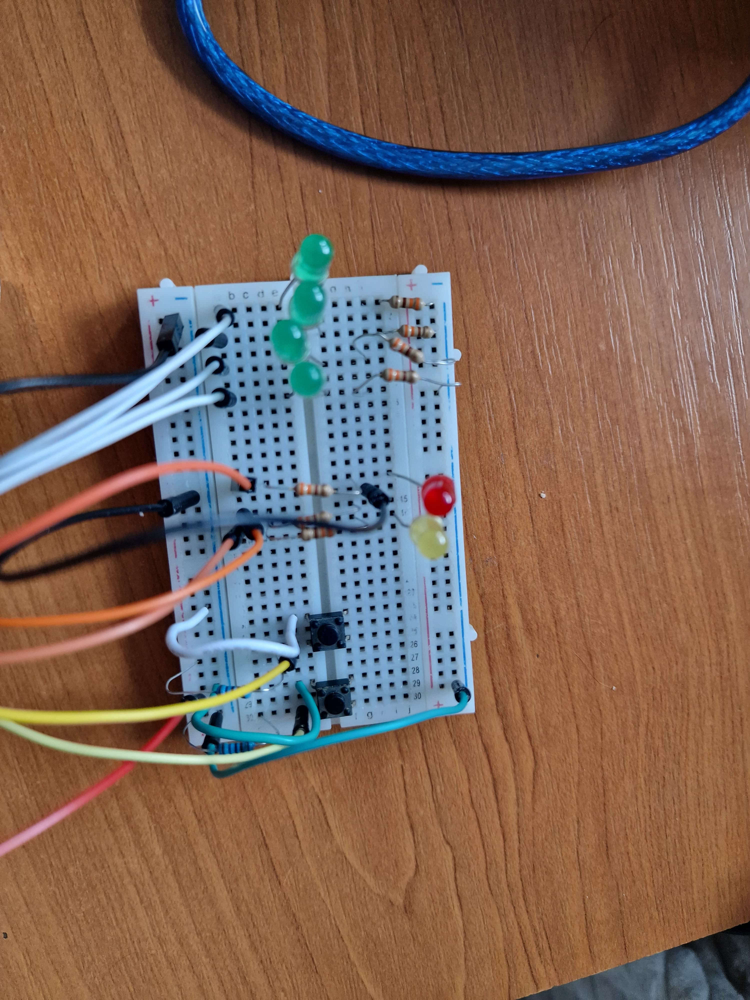
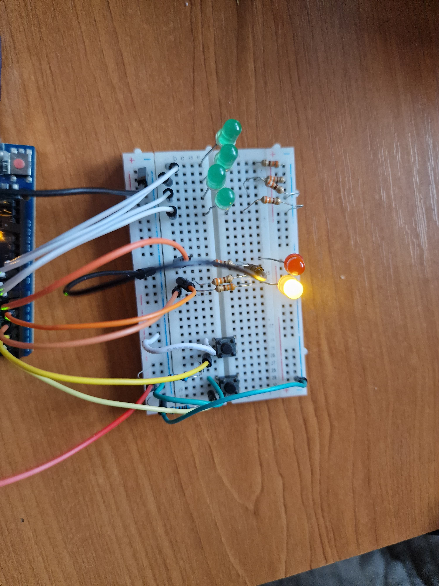
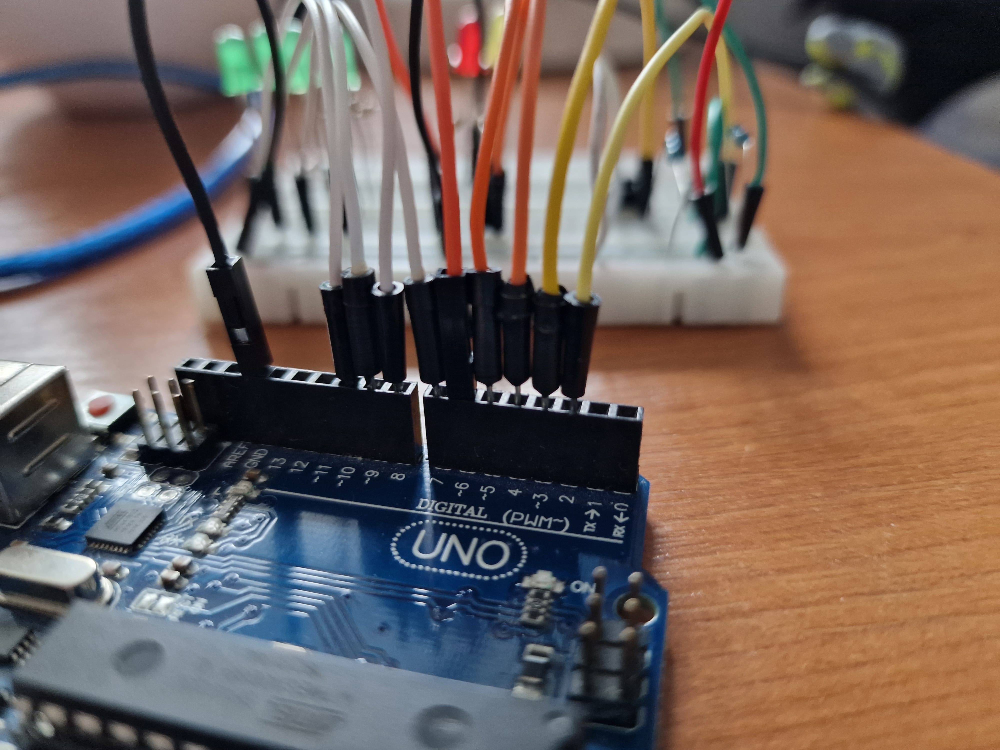
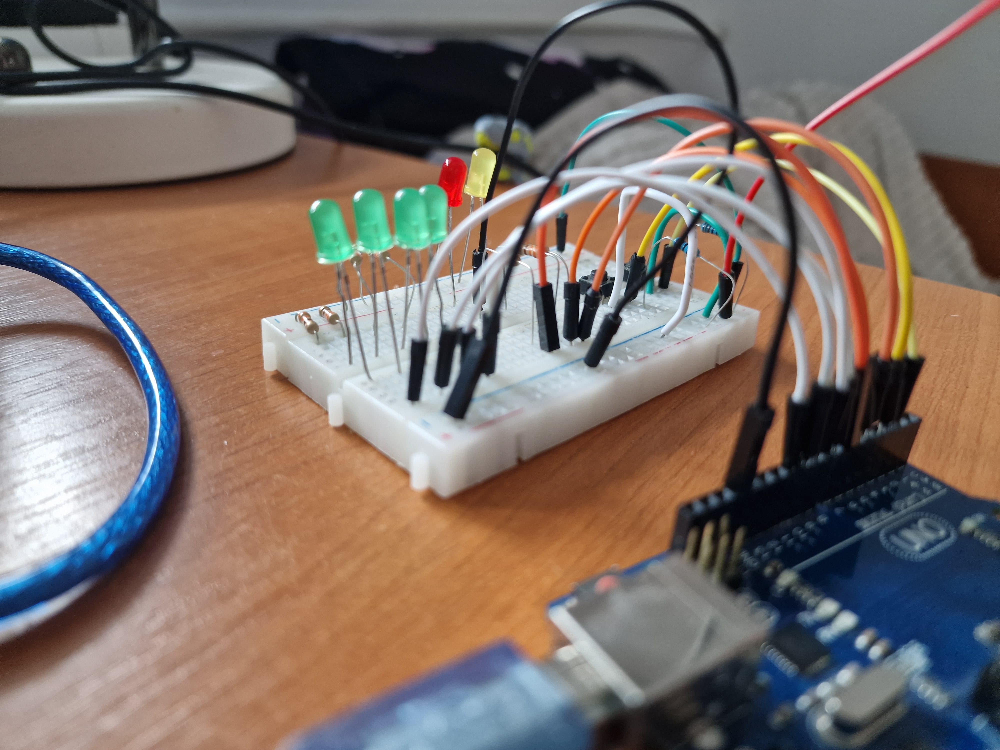
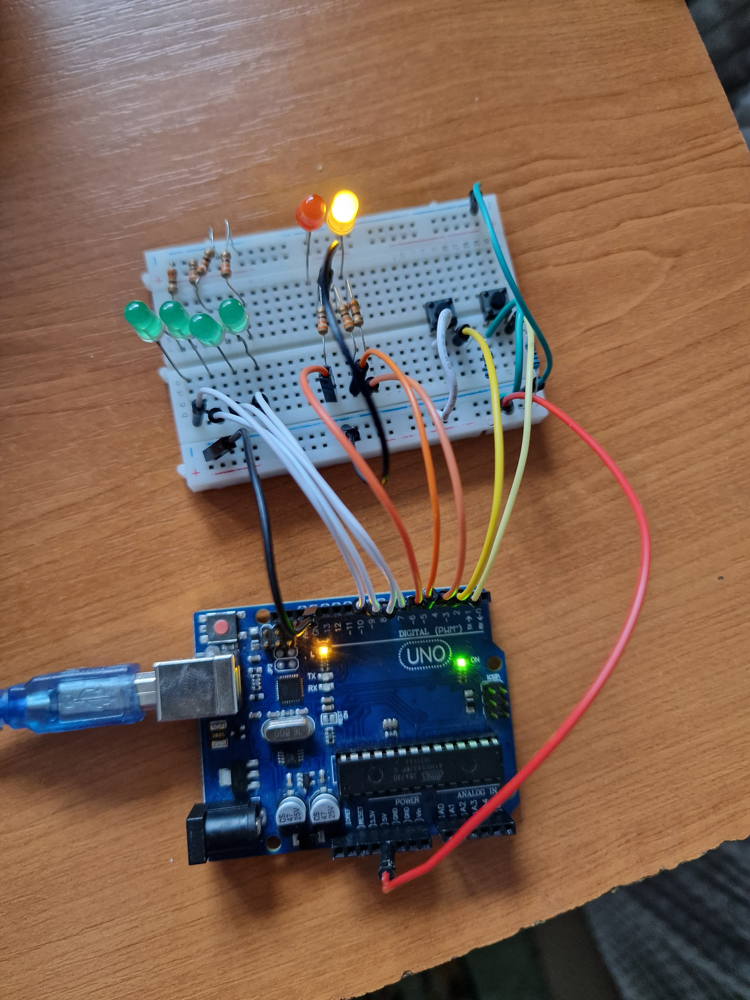

# Homework 1 - EV Charger

## Description
The goal of this project is to simulate a charging station for an electric vehicle using multiple LEDs and buttons. This includes managing button states with debouncing and coordinating all components to reflect a real-life scenario.

## Tasks
### RGB LED - Station Availability
- When the station is free, the RGB LED will be green.
- When the station is occupied, the RGB LED will turn red.
### Simple LEDs - Charging Progress
- The simple LEDs simulate the battery's charge level through a progressive loader:
  - L1 = 25%, L2 = 50%, L3 = 75%, L4 = 100%.
- LEDs light up sequentially at fixed intervals of 3 seconds.
- The current charging LED will blink, while previous LEDs remain lit, and the others stay off.
### Start Button
- A short press on the start button begins the charging process.
- Pressing this button during charging has no effect.
### Stop Button
- A long press on the stop button forcibly stops the charging and resets the station to the free state.
- Pressing the stop button while the station is free has no effect.

## Components
- 4 LEDs: To simulate the battery's charge percentage.
- 1 RGB LED: To indicate the station's availability (free or busy).
- 2 Buttons: For starting and stopping the charging process.
- 8 Resistors: (6x 220/330 Ω, 2x 1 kΩ).
- Breadboard.
- Connecting wires.

## Software implementation

- will store the EV Charger state, that can be modify when a button is pressed
- if the *start button* is pressed and the state is **FREE**, the state will be change to **CHARGING**
- if the *stop button* is pressed and the state is **CHARGING**, the state will be change to **ENDING**
- after the **CHARGING** state is over the state will become **ENDING**
- after the **ENDING** state is over the state will become **FREE**

### State description

#### FREE
- when the state become **FREE** the *RGB led* is set on green
- wait until the *start button* is pressed

#### CHARGING
- when the state become **CHARGING** the *RGB led* is set on red and we store the time when the charging begin
- use the time difference between the *current time* and the *time when the charging begin* to find out what led need to blink now
- use the same time difference to find out what state need the current led to be (LOW or HIGH)
- when **CHARGING** time had passed we change the state in **ENDING**

#### ENDING
- when the state become **ENDING** we store the time when the ending begin
- like in charging mode, use the time difference to find out what state need the leds to be (LOW or HIGH)
- after **3 seconds** we set the state as **FREE**

## Images

Electrical diagram
---

Breadboard layout
---

Breadboard on
---

Arduino Uno pin layout
---

Breadboard pin layout
---

Complete circuit

## Videos

- a demo of the project can be find [here](https://youtu.be/JvUOAv9nD8k)