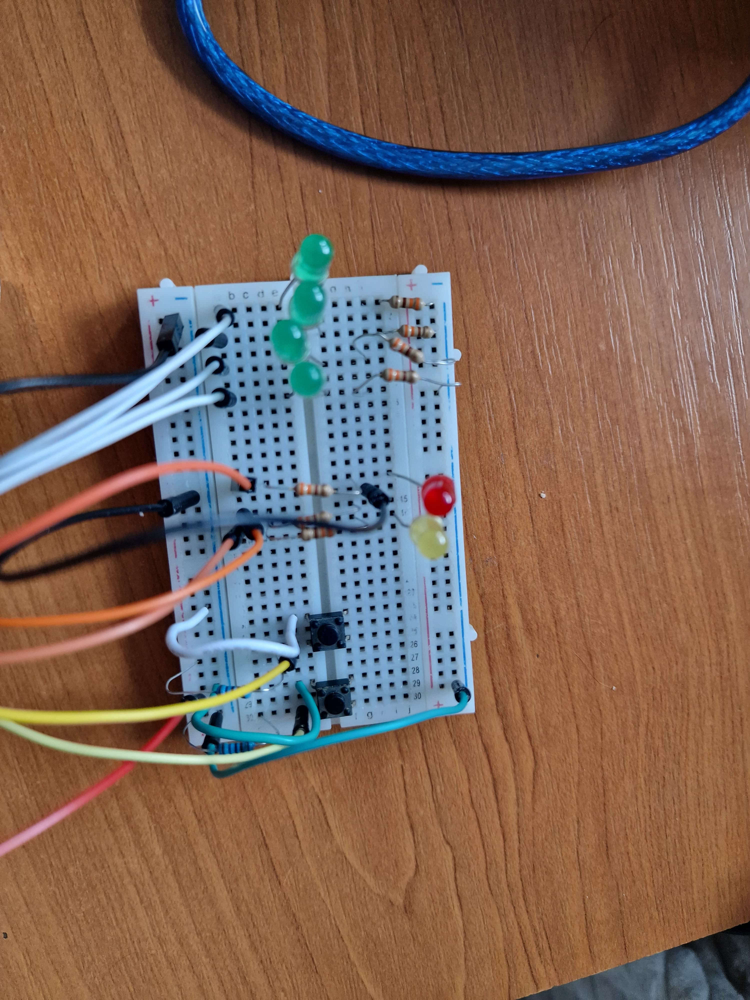
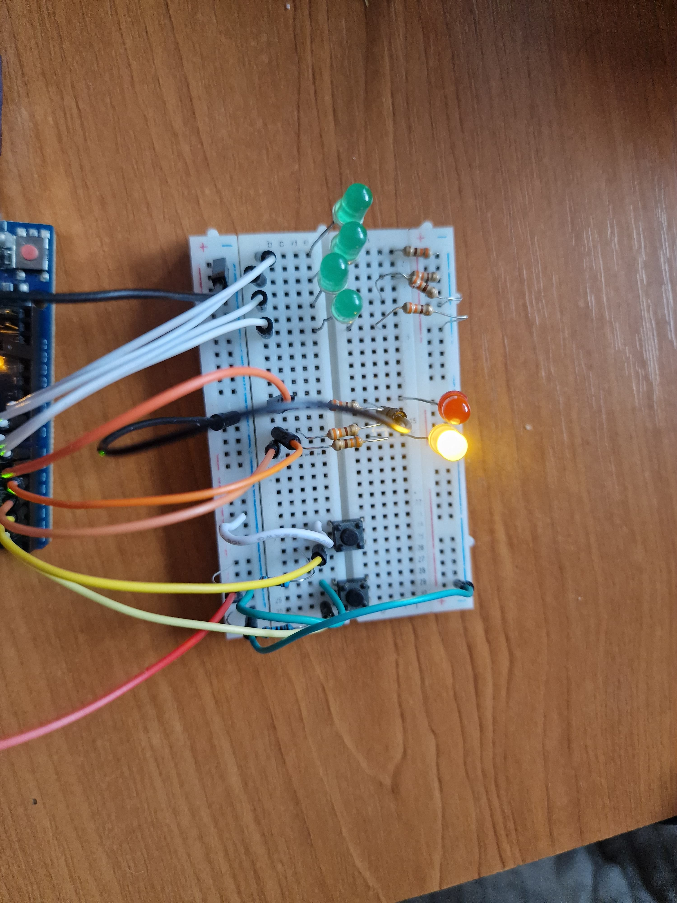
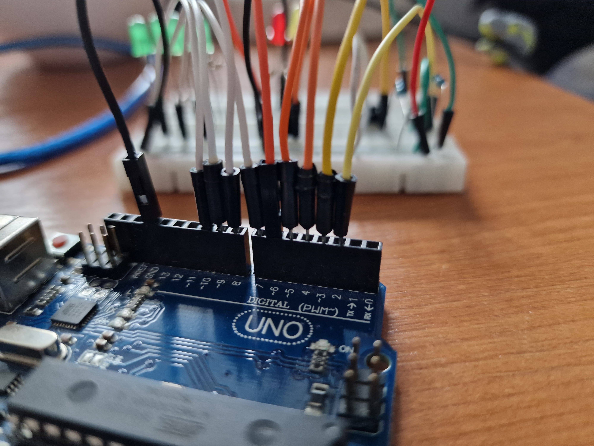
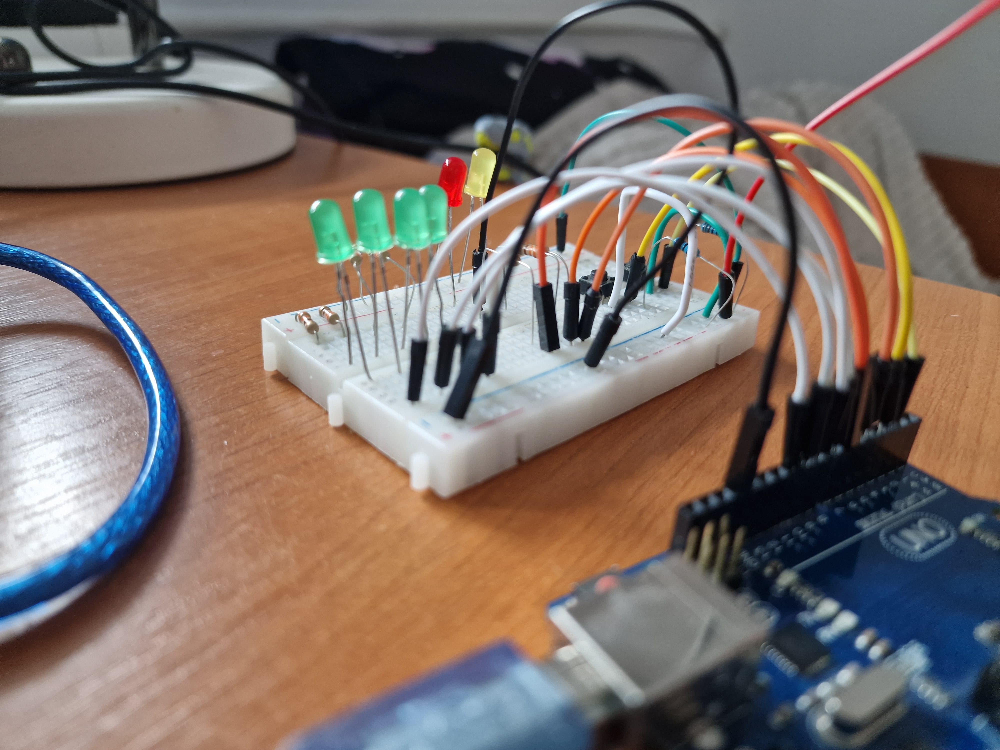
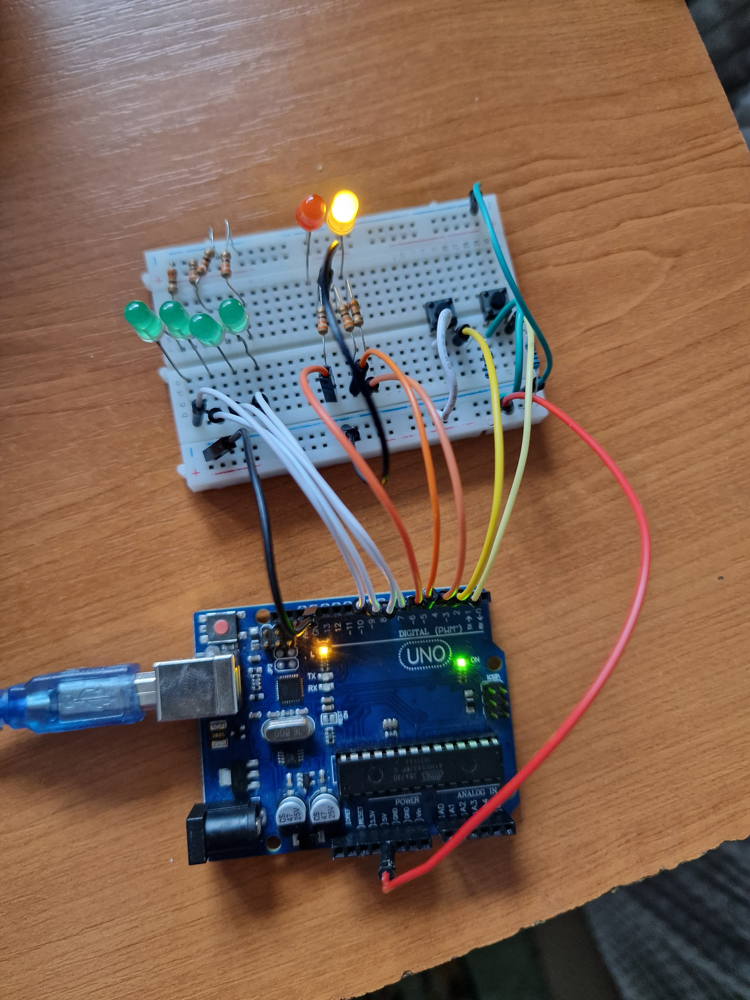

# Homework 2 - TypeRacer

## Description
This project is a simple TypeRacer game implemented using an Arduino UNO. Players race to type words correctly as they appear on the terminal within a limited time. Difficulty levels and a visual RGB indicator make the game engaging and challenging.

## Tasks
### LED RGB - Status Indicator
- *Idle*: LED is white.
- *Countdown*: LED blinks for 3 seconds before starting the round.
- *During Round*:
    - Green: Correct word typed.
    - Red: Incorrect word typed.
  
### Buttons
- **Start/Stop Button**
    - Starts the game or stops it during an active round.
- **Difficulty Button**
    - Cycles between difficulties (Easy, Medium, Hard) and displays the selected mode in the terminal.
 
### Word Generation
- **Random Words**
    - Words are displayed in a random order.
    - Based on difficulty, the speed and word selection vary.
- **Correct Words**
    - Displays the next word immediately.
- **Incorrect Words**
Introduces a delay before displaying the next word.
### Game Duration
- A single round lasts 30 seconds.
- At the end of the round, the number of correctly typed words is shown in the terminal.

### Components
- 1 Arduino UNO: Microcontroller for game logic
- 1 LED RGB: Visual indicator for game status
- 2 Buttons: Start/stop and difficulty control
- 5 Resistors: (3x 220/330 Ω, 2x 1 kΩ).
- Breadboard: Prototyping circuit connections
- Jumper Wires: Connecting components

## Software implementation
- will store the game state and the difficulty 
- store multiple words for each difficulty level
- the game will have 2 scenarios
  - if the word is from the easy bucket, a timer will be set to make new works appear (with 3 different timers)
  - if the word is from medium or hard bucket, after writing it correctly the next word will appear automatically

## Images

Electrical diagram
---

Breadboard layout
---

Breadboard on
---

Arduino Uno pin layout
---

Breadboard pin layout
---

Complete circuit

## Videos

- a demo of the project can be find [here](https://youtu.be/_y8PmHgVvrs)